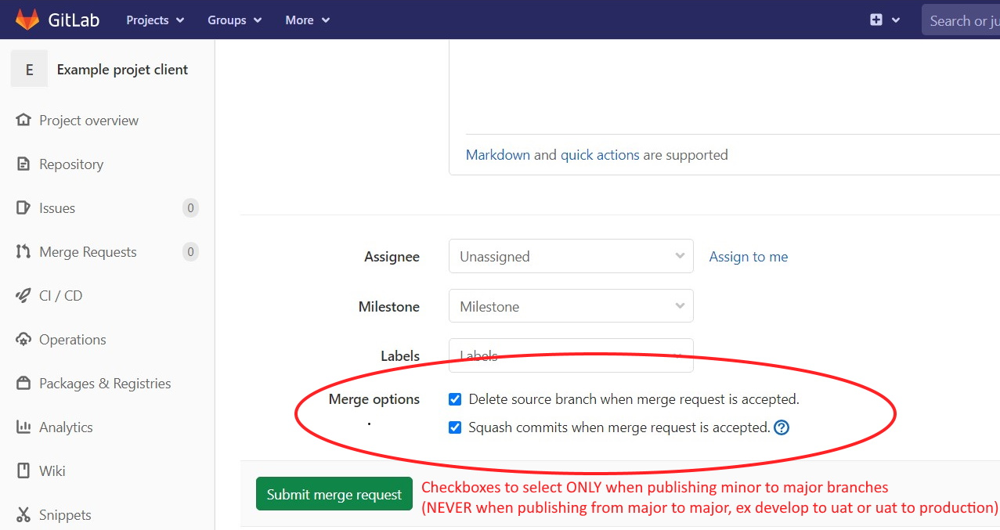

<!-- markdownlint-disable MD013 -->

## Commit your updates

- If you made updates on your org that you have not pulled yet, Use command  to **pull your latest updates in local files**
  - If you updated config elements that you do not see in your local files, you may discuss with your release manager to [update CI/CD configuration](salesforce-ci-cd-config-home.md)
  - If it is not possible to use pull configuration, you may retrieve metadatas using  (but it will retrieve locally many files and it will be harder to select the ones you really need)

- In VsCode Git extension, **stage** and **commit** created, updated and deleted files that you want to publish
  - By selecting the metadata files you can **see the differences** with the previous versions, to know if you want to publish or not an updated file
  - **Never use Stage all function**

_The following video shows how to perform theses operations_

<iframe width="560" height="315" src="https://www.youtube.com/embed/Ik6whtflmfY" title="YouTube video player" frameborder="0" allow="accelerometer; autoplay; clipboard-write; encrypted-media; gyroscope; picture-in-picture" allowfullscreen></iframe>

## Prepare merge request

- **Once your commit is completed**, run command  to prepare your merge request.

- As you committed your files like explained in the previous section, select option  **_Under the hood_**
>
> The script performs the following operations:
>
> - Update `manifest/package.xml` automatically according to the committed updates
> - Clean XML of metadatas according to .sfdx-hardis.yml config property `autoCleanTypes` and `autoRemoveUserPermissions`
> - New git commit with automated updates
> - Git push commit to git server
> 
> More details in [hardis:work:save](https://hardisgroupcom.github.io/sfdx-hardis/hardis/work/save/) command documentation

## Create merge request

### Using Gitlab

- Go in your online repository in your web browser (example: `https://gitlab.com/trailheadapps/dreamhouse-lwc`)

- Go to menu **Merge Requests**

- Create a **New Merge request**

{ align=center }

{ align=center }

- Click on **Submit merge request**

- Controlling jobs are automatically launched, you can now ask your release manager to [**validate a merge request**](salesforce-ci-cd-validate-merge-request.md)
  - _If you are a developer, (or even a business consultant depending on the project organization), you may have the responsibility to make sure than controlling jobs are valid (**check-deploy job** and **code-quality job** in **success**)_

- If you need to add additional updates to an existing merge requests, you just this to follow again this guide from the beginning, except the part "Create a merge request". Any new commit pushed on a branch where there is already a merge request will trigger again the [control jobs](salesforce-ci-cd-validate-merge-request.md#control-jobs). 

### Using Github

Same than with Gitlab, but Merge Requests are named **Pull Requests**

### Using Azure

Same than with Gitlab, but Merge Requests are named **Pull Requests**
